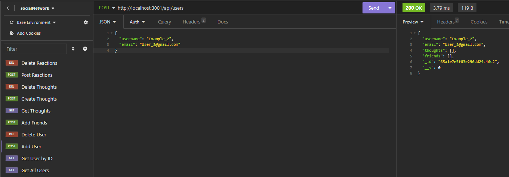

# Employee Tracker

[](https://opensource.org/licenses/MIT)

## Description
This project is a full-stack social network web application API built using Express.js for routing, MongoDB as the NoSQL database, and Mongoose ODM. The API allows users to share thoughts, react to friends' thoughts, and manage friend lists. The project follows the guidelines provided in the challenge from the edX Boot Camps.

## Features
- Add Get all Users
- Get Users by ID
- Add a User
- Delete a User
- Add Friends to a User
- Add Thoughts
- Delete Thoughts
- Get all Thoughts
- React to a Thought
- Delete a Reaction

## Live Preview


Here is a Walkthrough Video you can follow along with https://drive.google.com/file/d/1DffttKO7jsxtKGAgWUYeF4_Yw3RY5C9s/view

## Table of Contents
- [Description](#description)
- [Features](#features)
- [Installation](#installation)
- [Usage](#usage)
- [License](#license)
- [Contributing](#contributing)
- [Questions](#questions)
## Installation
Before using this application, you'll need to install the necessary dependencies. To do this, follow these steps: 
later
```bash
npm install
```

## Usage
```bash
cd into the repository
node index
```
## License 
### The MIT License
[https://opensource.org/licenses/MIT](https://opensource.org/licenses/MIT)

## Contributing
If you would like to contribute to this project, please follow the guidelines outlined in the Contributing Guide.

## Questions
If you have questions or need further assistance with this project, please feel free to contact me via:
- E-Mail: CarrilloUriel81@gmail.com
- GitHub: [UCarr81](https://github.com/UCarr81)